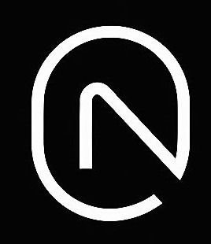

<div align="center">
  
  <br/>
  <h1>𝐂 𝐑 𝐄 𝐀 𝐓 𝐈 𝐕 𝐄 𝐍 𝐎 𝐃 𝐄</h1>
  <p><strong><em>Design. Build. Innovate.</em></strong></p>
  <p>An exclusive digital atelier offering premium poster design, high-end branding, and bespoke web aesthetics.</p>

  <p>
    <a href="https://creativenode.in"><strong>Visit the Showcase</strong></a> ·
    <a href="https://creativenode.in/admin"><strong>Admin CRM</strong></a> ·
    <a href="mailto:hello@creativenode.in"><strong>Contact</strong></a>
  </p>
</div>

<br/>

## ✦ The Vision
**CreativeNode** is not just an agency; it is a meticulously crafted digital ecosystem built for brands that demand perfection. We blend luxury aesthetics with state-of-the-art web technology to deliver immersive digital experiences, captivating social media campaigns, and elegant branding solutions starting at ₹150.

Our platform is engineered from the ground up to reflect the premium quality of the work we produce—featuring fluid GSAP animations, a bespoke dark-mode interface with gold accents, and a custom-built CRM.

---

## ✦ Platform Architecture

The CreativeNode ecosystem is divided into two seamlessly integrated environments:

### 1. The Client Showcase (Public Interface)
A high-performance, visually stunning portfolio designed to captivate and convert.
- **Cinematic Experience:** Smooth, hardware-accelerated animations using `GSAP` and `ScrollTrigger`.
- **Premium Aesthetics:** A carefully curated color palette featuring deep inks, soft creams, and striking gold accents.
- **Interactive Portfolio:** A custom-built horizontal reel to browse high-definition client work with seamless Apple-style interactive live previews.
- **Dynamic Theming:** An underlying theme engine adapting the UI to match the visual language of specific client projects.

### 2. The Command Center (Admin CRM)
A secure, real-time administrative hub for managing the agency's operations.
- **Live Analytics:** Real-time visitor tracking and lead conversion metrics powered by Supabase Realtime subscriptions.
- **Portfolio Management:** Instantly upload new works, configure live website previews, and manage client metadata.
- **Lead Inbox:** A centralized messaging center for direct client inquiries and project briefs.
- **Role-Based Security:** Strict access control ensuring only authorized personnel can access sensitive operational data.

---

## ✦ Technology Stack

CreativeNode is built with a modern, high-performance stack prioritizing speed, security, and developer experience.

| Category | Technology | Description |
| :--- | :--- | :--- |
| **Core Framework** | **React 18 & Vite** | Lightning-fast rendering and optimized build processes. |
| **Styling Engine** | **Tailwind CSS** | Utility-first styling with custom typography and color tokens. |
| **Animations** | **GSAP** | Industry-standard smooth scroll and complex timeline animations. |
| **Backend & Auth** | **Supabase** | Secure PostgreSQL database, Row Level Security (RLS), and authentication. |
| **Routing** | **React Router v6** | Client-side routing with optimized state transitions. |
| **Deployment** | **Vercel** | Edge-network hosting with serverless routing configurations. |

---

## ✦ Getting Started

To run the CreativeNode platform locally:

```bash
# 1. Clone the repository
git clone https://github.com/puspharajm2003/creativenode.git

# 2. Navigate to the project directory
cd "Creativenode Website"

# 3. Install dependencies
npm install

# 4. Set up your environment variables
# Create a .env file and add your Supabase credentials:
# VITE_SUPABASE_URL=your_url
# VITE_SUPABASE_ANON_KEY=your_key

# 5. Start the development server
npm run dev
```

---

<div align="center">
  <p><em>Designed with precision. Engineered with passion.</em></p>
  <p>© 2026 CreativeNode. All rights reserved.</p>
</div>
